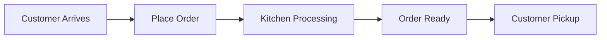

# 🍔 Fast Food Restaurant Simulator

## 📋 Overview
An interactive simulation of a fast-food restaurant operation, featuring real-time order processing, kitchen management, and customer flow visualization. Built with modern JavaScript and featuring a sleek, responsive interface.

## ✨ Features
- 🕒 Real-time order processing
- 👨‍🍳 Kitchen staff management
- 🧍 Customer queue visualization
- 🎯 Order status tracking
- 📊 Performance metrics
- 🎨 Modern, responsive UI

## 🚀 Getting Started

### Prerequisites
- Node.js (v14 or higher)
- npm (v6 or higher)

### Installation
1. Clone the repository:
   ```bash
   git clone https://github.com/MaxPopovschii/fastfood-simulator.git
   ```

2. Navigate to project directory:
   ```bash
   cd fastfood-simulator
   ```

3. Install dependencies:
   ```bash
   npm install
   ```

## 💻 Usage

### Start the Simulator
```bash
npm start
```
The simulator will be available at `http://localhost:8000`

### Configuration
Adjust simulation parameters in the UI:
- Customer arrival rate
- Order processing time
- Cooking duration
- Server delivery speed

## 🧪 Testing

### Run all tests
```bash
npm test
```

### Run with coverage
```bash
npm run test:coverage
```

## 🏗️ Architecture

### Components
- `Restaurant`: Core simulation logic
- `Customer`: Customer behavior management
- `Order`: Order processing and tracking
- `UI`: Real-time visualization

### Flow


## 🔧 Technical Stack
- JavaScript (ES6+)
- Jest for testing
- CSS3 with animations
- HTML5

## 📈 Performance
- Handles up to 100 concurrent customers
- Real-time updates every 100ms
- Memory efficient queue management

## 🤝 Contributing
1. Fork the repository
2. Create your feature branch (`git checkout -b feature/AmazingFeature`)
3. Commit changes (`git commit -m 'Add some AmazingFeature'`)
4. Push to branch (`git push origin feature/AmazingFeature`)
5. Open a Pull Request

## 📝 License
This project is licensed under the MIT License - see the [LICENSE](LICENSE) file for details.

## 👥 Authors
- Your Name - *Initial work* - [MyGithub](https://github.com/MaxPopovschii)

## 🙏 Acknowledgments
- Inspired by real-world fast food operations
- Built with modern best practices
- Community feedback and contributions